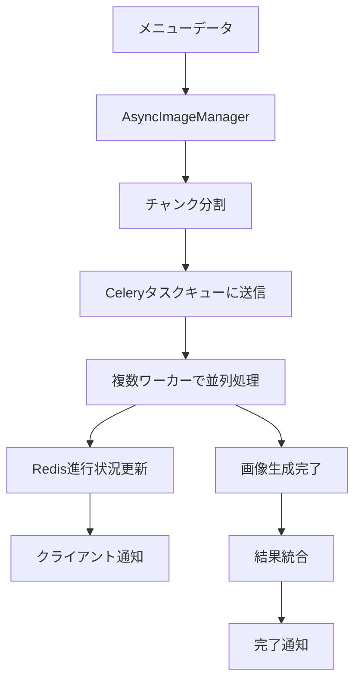
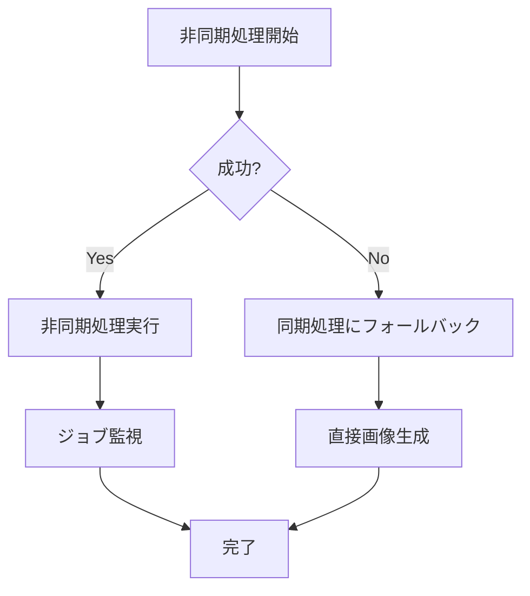

# 非同期画像生成システム (Celery + Redis)

## 概要

Menu Sensorアプリケーションに、**Celery + Redis**を使った非同期画像生成システムが追加されました。これにより、大量のメニューアイテムでも効率的な並列画像生成が可能になりました。

## 🚀 主な特徴

### 1. **真の非同期処理**
- **Celeryワーカー**による分散処理
- メインプロセスをブロックしない
- 複数のタスクを並列実行

### 2. **リアルタイム進行状況**
- **Redis**での進行状況追跡
- クライアントへのリアルタイム通知
- チャンク単位での詳細な進捗表示

### 3. **堅牢なフォールバック機能**
- 非同期処理失敗時は自動的に同期処理に切り替え
- エラー耐性の高いシステム設計
- 部分的失敗にも対応

### 4. **スケーラビリティ**
- ワーカー数の調整可能
- チャンクサイズの最適化
- 負荷に応じた自動調整

## 📁 システム構成

```
app/
├── tasks/
│   ├── celery_app.py          # Celeryアプリケーション設定
│   ├── image_tasks.py         # 画像生成タスク定義
│   └── utils.py               # Redis進行状況管理、ユーティリティ
├── services/image/
│   ├── async_manager.py       # 非同期処理管理クラス
│   ├── imagen3.py            # Imagen3画像生成サービス
│   └── base.py               # ベース画像サービス
└── api/v1/endpoints/
    └── image.py              # 非同期画像生成API
```

## ⚙️ 設定項目

### 環境変数 (.env)

```bash
# Redis/Celery設定
REDIS_URL=redis://localhost:6379/0

# 非同期画像生成設定
ASYNC_IMAGE_ENABLED=true
MAX_IMAGE_WORKERS=3
IMAGE_JOB_TIMEOUT=1800
IMAGE_PROCESSING_CHUNK_SIZE=3
IMAGE_CONCURRENT_CHUNK_LIMIT=3
USE_REAL_IMAGE_GENERATION=true

# Imagen3 API設定
GEMINI_API_KEY=your_gemini_api_key
IMAGE_GENERATION_ENABLED=true
```

### 設定パラメータ詳細

| パラメータ | デフォルト | 説明 |
|-----------|-----------|------|
| `ASYNC_IMAGE_ENABLED` | `true` | 非同期画像生成の有効/無効 |
| `MAX_IMAGE_WORKERS` | `3` | 最大Celeryワーカー数 |
| `IMAGE_JOB_TIMEOUT` | `1800` | ジョブタイムアウト（秒） |
| `IMAGE_PROCESSING_CHUNK_SIZE` | `3` | チャンクサイズ（アイテム数） |
| `IMAGE_CONCURRENT_CHUNK_LIMIT` | `3` | 同時実行チャンク数 |
| `USE_REAL_IMAGE_GENERATION` | `true` | 実際の画像生成を行うか（falseでモック処理） |

## 🔧 セットアップ

### 1. 依存関係インストール

```bash
pip install -r requirements.txt
```

### 2. Redisサーバー起動

```bash
# Dockerの場合
docker run -d -p 6379:6379 redis:latest

# macOSの場合
brew install redis
brew services start redis

# Ubuntu/Debianの場合
sudo apt install redis-server
sudo systemctl start redis-server
```

### 3. Celeryワーカー起動

```bash
cd menu_sensor_backend
celery -A app.tasks.celery_app worker --loglevel=info --concurrency=3
```

### 4. FastAPIサーバー起動

```bash
uvicorn app.main:app --reload --host 0.0.0.0 --port 8000
```

## 🧪 テスト実行

### 統合テスト

```bash
# 完全な統合テスト（命名規則、実際の画像生成、モック処理すべてをテスト）
python test_async_image_integration.py
```

**テストに含まれる項目:**
- ✅ Redis/Celery接続確認
- ✅ ファイル名命名規則一貫性テスト
- ✅ 実際の画像生成 vs モック処理テスト
- ✅ AsyncImageManager直接テスト
- ✅ Stage 5非同期画像生成テスト

### Celery段階別テスト

```bash
# Step 1-4のテスト
python test_celery_step1.py
python test_celery_step2.py
python test_celery_step3.py
python test_celery_step4.py
```

## 📡 API使用方法

### 1. 非同期画像生成開始

```bash
curl -X POST "http://localhost:8000/api/v1/image/generate-async" \
  -H "Content-Type: application/json" \
  -d '{
    "final_menu": {
      "前菜": [
        {
          "japanese_name": "枝豆",
          "english_name": "Edamame",
          "description": "Lightly salted boiled soybeans"
        }
      ]
    },
    "session_id": "test_session"
  }'
```

**レスポンス（202 Accepted）:**
```json
{
  "success": true,
  "job_id": "img_20241201_123456_abc123",
  "status": "queued",
  "total_items": 1,
  "estimated_time_seconds": 2,
  "status_endpoint": "/api/v1/image/status/img_20241201_123456_abc123"
}
```

### 2. 進行状況確認

```bash
curl "http://localhost:8000/api/v1/image/status/{job_id}"
```

**レスポンス:**
```json
{
  "job_id": "img_20241201_123456_abc123",
  "status": "processing",
  "progress_percent": 50,
  "processing_info": {
    "total_chunks": 1,
    "completed_chunks": 0,
    "total_items": 1
  }
}
```

### 3. 完了時のレスポンス

```json
{
  "job_id": "img_20241201_123456_abc123",
  "status": "completed",
  "progress_percent": 100,
  "images_generated": {
    "前菜": [
      {
        "japanese_name": "枝豆",
        "english_name": "Edamame",
        "image_url": "/uploads/edamame_20241201_123500.png",
        "generation_success": true
      }
    ]
  },
  "total_images": 1,
  "success_rate": 100
}
```

## 🔄 処理フロー

### 1. 非同期処理（推奨）



### 2. フォールバック処理



## 🏷️ ファイル命名規則

### 統一された命名規則

すべての画像ファイルは以下の統一された命名規則に従います：

```
menu_image_{safe_name}_{timestamp}.png
```

**例:**
- `Edamame` → `menu_image_edamame_20241201_123456.png`
- `Cafe Latte` → `menu_image_cafe_latte_20241201_123456.png`
- `Today's Special` → `menu_image_todays_special_20241201_123456.png`

### 安全なファイル名変換

- **英数字以外の文字**: 削除
- **スペース**: アンダースコア（`_`）に変換
- **大文字**: 小文字に変換
- **長さ制限**: 30文字まで

この命名規則により、元の同期処理と非同期処理で一貫したファイル名が生成されます。

## 🎭 実際の画像生成 vs モック処理

### 2つの処理モード

| モード | タスク | 説明 | 用途 |
|--------|-------|------|------|
| **実際の画像生成** | `real_image_chunk_task` | Imagen3 APIで実際に画像を生成 | 本番環境、実際の画像が必要な場合 |
| **モック処理** | `advanced_image_chunk_task` | 高速な模擬処理、画像は生成しない | 開発・テスト環境、動作確認 |

### 設定による切り替え

```bash
# 実際の画像生成を行う（デフォルト）
USE_REAL_IMAGE_GENERATION=true

# モック処理のみ（高速テスト用）
USE_REAL_IMAGE_GENERATION=false
```

### 自動フォールバック

実際の画像生成モードでも、以下の場合は自動的にモック処理にフォールバックします：

- ✅ **Imagen3サービスが利用できない場合**
- ✅ **API認証情報が不正な場合**
- ✅ **個別アイテムの生成に失敗した場合**

これにより、システムの堅牢性を保ちながら開発・テストを効率化できます。

## 📊 監視とデバッグ

### Celeryワーカー監視

```bash
# ワーカー状態確認
celery -A app.tasks.celery_app inspect active

# タスクキュー確認
celery -A app.tasks.celery_app inspect reserved

# 統計情報
celery -A app.tasks.celery_app inspect stats
```

### Redis監視

```bash
# Redis CLI接続
redis-cli

# キー確認
keys *

# ジョブ情報確認
get "job:img_20241201_123456_abc123:info"
```

### ログ監視

```bash
# Celeryワーカーログ
tail -f celery.log

# FastAPIサーバーログ
tail -f fastapi.log
```

## 🎯 パフォーマンス最適化

### 1. チューニングパラメータ

```python
# 高性能設定（強力なサーバー用）
MAX_IMAGE_WORKERS = 5
IMAGE_PROCESSING_CHUNK_SIZE = 5
IMAGE_CONCURRENT_CHUNK_LIMIT = 5

# 軽量設定（制限された環境用）
MAX_IMAGE_WORKERS = 2
IMAGE_PROCESSING_CHUNK_SIZE = 2
IMAGE_CONCURRENT_CHUNK_LIMIT = 2
```

### 2. メモリ使用量監視

```bash
# Redisメモリ使用量
redis-cli info memory

# Celeryワーカーメモリ使用量
ps aux | grep celery
```

## ⚠️ トラブルシューティング

### よくある問題と解決方法

#### 1. Redisに接続できない
```bash
# Redis起動確認
redis-cli ping
# 期待される出力: PONG

# ポート確認
netstat -tlnp | grep 6379
```

#### 2. Celeryワーカーが応答しない
```bash
# ワーカー再起動
pkill -f celery
celery -A app.tasks.celery_app worker --loglevel=info

# ワーカー状態確認
celery -A app.tasks.celery_app inspect active
```

#### 3. ジョブがタイムアウトする
- `IMAGE_JOB_TIMEOUT`を増加
- `IMAGE_PROCESSING_CHUNK_SIZE`を削減
- `MAX_IMAGE_WORKERS`を増加

#### 4. 画像生成が失敗する
- `GEMINI_API_KEY`の確認
- `IMAGE_GENERATION_ENABLED=true`の確認
- APIクォータの確認

## 📈 将来の拡張予定

### 1. 高度な機能
- **ジョブ優先度制御**
- **動的ワーカースケーリング**
- **失敗タスクの自動リトライ**
- **詳細な分析ダッシュボード**

### 2. 統合機能
- **WebSocket進行状況通知**
- **バッチ処理API**
- **履歴管理システム**
- **パフォーマンス分析**

## 🤝 貢献

バグ報告や機能提案は、GitHubのIssueでお知らせください。

## 📝 ライセンス

このプロジェクトはMITライセンスの下で公開されています。 