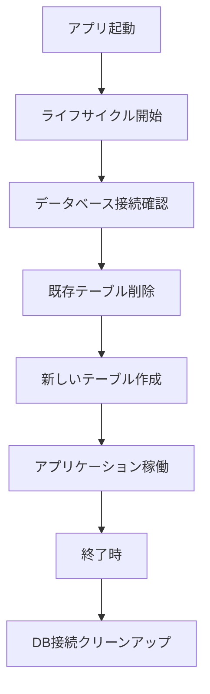
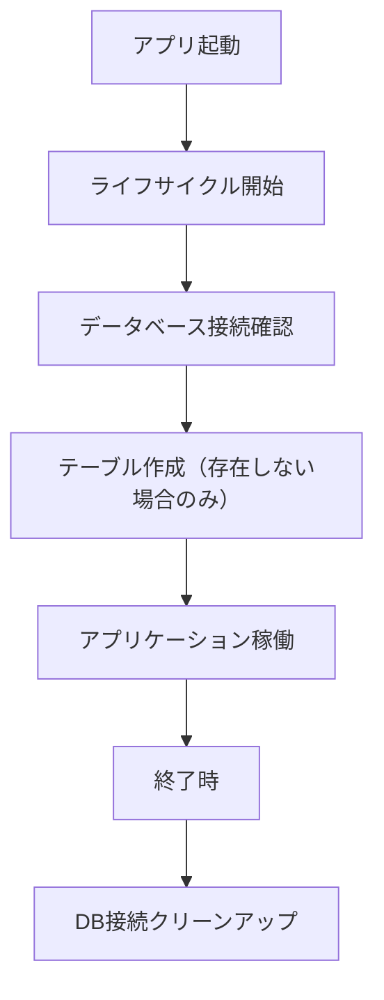

# 自動DB初期化機能仕様書

## 📋 概要

app_2では、開発効率向上のため、アプリケーション起動時に自動でデータベースを初期化する機能を提供しています。この機能により、毎回クリーンな状態でアプリケーションを開始することができます。

## 🎯 目的

- **開発効率向上**: 毎回手動でDBをクリアする必要がない
- **一貫性確保**: 常に同じ初期状態から開発を開始
- **テスト環境**: 各テストセッションで独立したDB状態を保証
- **オンオフ制御**: 本番環境では無効化可能

## ⚙️ 設定

### 環境変数

| 変数名 | 値 | 動作 | 用途 |
|--------|----|----- |------|
| `AUTO_RESET_DATABASE` | `true` | 起動時にテーブル削除→再作成 | 開発・テスト環境 |
| `AUTO_RESET_DATABASE` | `false` | 起動時にテーブル作成のみ | 本番・ステージング環境 |
| 未設定 | - | `false`と同じ動作 | デフォルト（安全側） |

### 設定ファイル

**.env**
```bash
# 開発時の設定例
AUTO_RESET_DATABASE=true
DEBUG_MODE=true

# 本番時の設定例
AUTO_RESET_DATABASE=false
DEBUG_MODE=false
```

## 🔄 動作フロー

### 起動時（AUTO_RESET_DATABASE=true）



### 起動時（AUTO_RESET_DATABASE=false）



## 🛠️ 実装詳細

### 1. 設定管理（config.py）

```python
class BaseSettings(BaseModel):
    # データベース自動リセット設定
    auto_reset_database: bool = os.getenv("AUTO_RESET_DATABASE", "false").lower() == "true"
```

### 2. データベース初期化（database.py）

```python
async def init_database():
    """
    データベースの初期化
    AUTO_RESET_DATABASE=true の場合、既存テーブルを削除してから再作成
    """
    # 接続チェック
    if not await DatabaseManager.check_connection():
        raise RuntimeError("Database connection failed")
    
    # 自動リセット機能チェック
    if settings.base.auto_reset_database:
        logger.info("🗑️ AUTO_RESET_DATABASE enabled - Dropping existing tables...")
        await DatabaseManager.drop_tables()
    
    # テーブル作成
    await DatabaseManager.create_tables()
```

### 3. ライフサイクル管理（main.py）

```python
@asynccontextmanager
async def lifespan(app: FastAPI):
    # アプリケーション起動時
    await init_database()
    yield
    # アプリケーション終了時
    await shutdown_database()

app = FastAPI(lifespan=lifespan)
```

## 📊 ログ出力例

### 自動リセット有効時

```
🔄 Initializing database...
📊 MenuModel imported and registered
✅ Database connection successful
🗑️ AUTO_RESET_DATABASE enabled - Dropping existing tables...
✅ Existing tables dropped successfully
✅ Database tables created successfully
✅ Database reset and initialization completed
```

### 自動リセット無効時

```
🔄 Initializing database...
📊 MenuModel imported and registered
✅ Database connection successful
✅ Database tables created successfully
✅ Database initialization completed
```

## 🚀 使用方法

### 1. 開発環境での起動

```bash
# .envでAUTO_RESET_DATABASE=trueに設定済みの場合
python -m app_2.main

# 環境変数で一時的に設定
AUTO_RESET_DATABASE=true python -m app_2.main
```

### 2. 本番環境での起動

```bash
# .envでAUTO_RESET_DATABASE=falseに設定済みの場合
python -m app_2.main

# 環境変数で明示的に無効化
AUTO_RESET_DATABASE=false python -m app_2.main
```

### 3. 設定確認

```python
from app_2.core.config import settings
print(f"自動リセット機能: {settings.base.auto_reset_database}")
```

## ⚠️ 注意事項

### 1. データ消失リスク

- `AUTO_RESET_DATABASE=true`では、**すべてのデータが削除**されます
- 本番環境では**必ず`false`**に設定してください
- バックアップが必要なデータは事前に保存してください

### 2. パフォーマンス

- テーブル削除・再作成によりアプリ起動時間が若干増加します
- 大量データがある場合は削除に時間がかかる可能性があります

### 3. 接続エラー

- データベース接続が失敗した場合、アプリケーションは起動しません
- DATABASE_URLの設定を確認してください

## 🧪 テスト方法

### 1. 機能テスト

```python
# 自動リセットONのテスト
AUTO_RESET_DATABASE=true python -c "
import asyncio
from app_2.core.database import init_database
asyncio.run(init_database())
"

# 自動リセットOFFのテスト  
AUTO_RESET_DATABASE=false python -c "
import asyncio
from app_2.core.database import init_database
asyncio.run(init_database())
"
```

### 2. データ保持テスト

```python
# 1. データ挿入
# 2. アプリ再起動
# 3. データ確認（ONなら削除、OFFなら保持）
```

## 🔧 トラブルシューティング

### 問題1: 自動リセットが動作しない

**原因**: 環境変数の設定ミス
```bash
# 確認方法
echo $AUTO_RESET_DATABASE
```

**解決策**: 正しい値を設定
```bash
export AUTO_RESET_DATABASE=true
```

### 問題2: テーブル削除でエラー

**原因**: 外部キー制約や権限不足
```
FOREIGN KEY constraint fails
```

**解決策**: CASCADEオプションで削除
```python
await conn.execute(text('DROP TABLE table_name CASCADE'))
```

### 問題3: アプリが起動しない

**原因**: データベース接続失敗
```
Database connection failed
```

**解決策**: DATABASE_URL確認
```bash
echo $DATABASE_URL
```

## 📚 関連ファイル

| ファイル | 役割 |
|----------|------|
| `app_2/core/config.py` | 設定管理 |
| `app_2/core/database.py` | DB初期化ロジック |
| `app_2/main.py` | ライフサイクル管理 |
| `.env` | 環境変数設定 |

## 🔄 バージョン履歴

| バージョン | 日付 | 変更内容 |
|------------|------|----------|
| 1.0.0 | 2025-07-16 | 初期実装・自動リセット機能追加 |

## 👥 貢献者

- システム設計・実装: AI Assistant
- 要件定義・テスト: Development Team

---

**⚡ 重要**: 本番環境では必ず`AUTO_RESET_DATABASE=false`に設定してください 