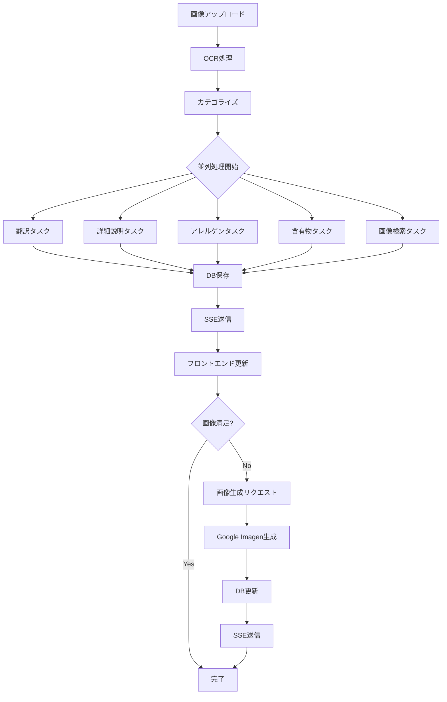

# ✅ 開発中プロジェクト：AIベースのメニュー翻訳・解析システム

## 🔧 技術スタック

| 分類                   | 技術・サービス                           |
| -------------------- | --------------------------------- |
| **APIフレームワーク**       | FastAPI                           |
| **非同期処理**            | Celery + Redis                    |
| **OCR**              | Google Cloud Vision API           |
| **翻訳**               | Google Translate API              |
| **詳細説明・アレルゲン・含有物抽出** | OpenAI GPT-4.1 mini               |
| **画像検索**             | Google Custom Search Engine（10件）  |
| **Google API統合管理**    | GoogleCredentialManager（一元認証）     |
| **ストレージ**            | AWS S3                            |
| **シークレット管理**         | AWS Secrets Manager               |
| **リアルタイム通信**         | Server-Sent Events (SSE)          |
| **DB（永続化）**          | SQLite（開発用）／SQLAlchemy ORM（毎回初期化） |
| **ログ・ユーティリティ**       | 独自 logger / ID生成ユーティリティ           |
| **プロンプト管理**          | YAML基盤プロンプト管理システム（多言語対応）        |

---

## 🧠 アーキテクチャ方針

| 方針                        | 内容                                                |
| ------------------------- | ------------------------------------------------- |
| **Clean Architectureベース** | `domain`, `infrastructure`, `services`, `api` を分離 |
| **SSEでリアルタイム更新**          | 各処理完了ごとに即時フロントに配信。最終集約レスポンスは原則なし                  |
| **タスク分離設計**               | 各ステップはCeleryタスクに分離。最大8並列。処理順に結果送信                 |
| **構造化されたデータ保存**           | `menu` テーブルに各処理結果を保存。ユーザー体験の持続・再利用が可能に            |
| **毎回DB初期化**               | Alembicは使わず、開発中は `create_all()` による初期化で対応         |

---

## 📝 プロンプト管理システム仕様

### 🎯 設計方針

| 項目                | 内容                                     |
|-------------------|----------------------------------------|
| **管理方式**          | YAML基盤での外部設定管理                       |
| **言語対応**          | 英語プロンプトのみ（ミニマル運用）                  |
| **モデル設定**         | `config.py`で一元管理（YAMLには含めない）         |
| **テンプレート機能**      | 変数置換による動的プロンプト生成                   |
| **シンプル構造**        | 必要最小限の機能のみ実装                       |
| **拡張性**           | 新しいプロンプト・機能追加が容易な構造              |

### 📁 ディレクトリ構造

```
app_2/                # 新規作成：リソース管理層
│    prompts/                  # プロンプト定義
│       ├── openai/              # AIプロバイダー別
│       │   ├── menu_analysis/   # 機能別グループ
│       │   │   ├── categorize.yaml    # カテゴライズ
│       │   │   ├── description.yaml    # 詳細説明生成
│       │   │   ├── allergen.yaml       # アレルゲン抽出
│       │   │   └── ingredient.yaml     # 含有物抽出
│   └── prompt_loader.py         # 新規作成：プロンプト管理ユーティリティ
```

### 📄 YAML構造仕様

#### 基本構造（シンプル版）

```yaml
# description.yaml 例
system: "You are a culinary expert. Generate detailed and appealing descriptions for dishes."

user: "Generate a detailed and appealing description for the following dish. Include characteristics, taste, cooking method, and cultural background.

Dish: {menu_item}

Description:"
```

- **`system`**: OpenAI APIのシステムメッセージ
- **`user`**: ユーザープロンプトテンプレート（`{menu_item}`等の変数を含む）
- **モデル設定**: `config.py`で管理（YAMLには含めない）

#### プロンプト別機能

| ファイル | 目的 | 説明 |
|---------|------|------|
| `description.yaml` | 詳細説明生成 | 料理の特徴、味、調理方法、文化的背景を含む詳細説明 |
| `allergen.yaml` | アレルゲン抽出 | 主要なアレルゲン（卵、乳、小麦、ナッツ、甲殻類等）を特定 |
| `ingredient.yaml` | 含有物抽出 | 主要な食材・調味料を列挙 |
| `categorize.yaml` | カテゴライズ | 料理を適切なカテゴリに分類 |

### 🔧 実装コンポーネント

#### 1. プロンプトローダー（`prompt_loader.py`）

```python
from typing import Dict
import yaml
from pathlib import Path

class PromptLoader:
    """シンプルなYAML基盤プロンプト管理クラス"""
    
    def __init__(self, base_path: str = "app_2/prompts"):
        self.base_path = Path(base_path)
    
    def load_prompt(
        self, 
        provider: str, 
        category: str, 
        prompt_name: str
    ) -> Dict[str, str]:
        """プロンプトを読み込み"""
        
    def format_prompt(self, template: str, **kwargs) -> str:
        """テンプレート変数を置換"""
        
    def get_system_prompt(self, provider: str, category: str, prompt_name: str) -> str:
        """システムプロンプトを取得"""
        
    def get_user_prompt(self, provider: str, category: str, prompt_name: str, **kwargs) -> str:
        """ユーザープロンプトを取得（変数置換済み）"""
```

#### 2. OpenAIクライアント修正

```python
class OpenAIClient:
    """OpenAI API クライアント（YAML管理対応版）"""
    
    def __init__(self):
        openai.api_key = settings.ai.openai_api_key
        self.prompt_loader = PromptLoader()
    
    async def generate_description(self, menu_item: str) -> str:
        """メニュー項目の詳細説明を生成（YAML管理）"""
        
        # システムプロンプト取得
        system_prompt = self.prompt_loader.get_system_prompt(
            "openai", "menu_analysis", "description"
        )
        
        # ユーザープロンプト取得（変数置換済み）
        user_prompt = self.prompt_loader.get_user_prompt(
            "openai", "menu_analysis", "description",
            menu_item=menu_item
        )
        
        # API呼び出し（設定はconfig.pyから取得）
        response = await openai.ChatCompletion.acreate(
            model=settings.ai.openai_model_name,
            messages=[
                {"role": "system", "content": system_prompt},
                {"role": "user", "content": user_prompt}
            ],
            max_tokens=200,  # config.pyで管理
            temperature=0.7  # config.pyで管理
        )
        
        return response.choices[0].message.content.strip()
```

### 🔄 使用例

```python
# プロンプトローダーの直接使用
loader = PromptLoader()
system_prompt = loader.get_system_prompt("openai", "menu_analysis", "description")
user_prompt = loader.get_user_prompt("openai", "menu_analysis", "description", menu_item="sushi")

# OpenAIクライアントでの使用
client = OpenAIClient()
description = await client.generate_description("sushi")
allergens = await client.extract_allergens("pasta carbonara")
ingredients = await client.extract_ingredients("pizza margherita")
```

### ✨ システムの利点

| 利点 | 詳細 |
|------|------|
| **保守性向上** | プロンプト変更時はYAMLファイルのみ修正 |
| **コード分離** | ビジネスロジックとプロンプトの分離 |
| **拡張性** | 新しいプロンプト・機能追加が容易 |
| **テスト性** | プロンプト単位でのテスト・検証が可能 |
| **非技術者対応** | YAMLファイル編集でプロンプト調整可能 |
| **ミニマル運用** | 必要最小限の機能で軽量・高速 |

### 📋 移行手順

1. ✅ **ディレクトリ構造作成**: `prompts/` 構造構築
2. ✅ **YAML化**: 既存プロンプトをシンプルなYAML形式に変換
3. ✅ **PromptLoader実装**: ミニマム版プロンプト管理ユーティリティ作成
4. ⭐ **OpenAIClient修正**: YAML読み込み対応に変更
5. ⭐ **テスト実装**: プロンプト読み込み・フォーマット検証

---

## 📁 ディレクトリ構成（実際の構成）

```
app_2/
├── main.py                       # FastAPI起動・アプリケーション設定
├── api/                          # APIエンドポイント定義
│   └── v1/endpoints/
│       ├── pipeline.py           # メイン処理パイプライン
│       ├── sse.py               # SSE接続エンドポイント
│       └── image_generate.py    # 画像生成エンドポイント
├── core/                         # 技術基盤・設定
│   ├── celery_app.py            # Celeryアプリケーション設定
│   ├── config.py                # アプリケーション設定
│   ├── database.py              # SQLAlchemyエンジン/Session管理
│   └── redis_client.py          # Redis接続・管理
├── domain/                       # ドメイン層（ビジネスロジック中心）
│   ├── entities/
│   │   └── menu_entity.py       # メニューエンティティ定義
│   └── repositories/
│       └── menu_repository.py   # メニューリポジトリ抽象化
├── infrastructure/               # インフラ層（外部依存・実装詳細）
│   ├── models/
│   │   └── menu_model.py        # SQLAlchemyモデル定義
│   └── integrations/            # 外部API連携
│       ├── aws/
│       │   ├── s3_uploader.py   # S3ファイルアップロード
│       │   └── secrets_manager.py # AWS Secrets Manager
│       ├── google/
│       │   ├── google_credential_manager.py # Google API一元管理
│       │   ├── google_vision_client.py    # OCR処理（最小限実装）
│       │   ├── google_translate_client.py # 翻訳（最小限実装）
│       │   └── google_search_client.py    # 画像検索（最小限実装）
│       └── openai_client.py     # OpenAI GPT連携
├── pipelines/                    # Celeryタスクオーケストレーション
│   ├── pipeline_runner.py       # パイプライン実行制御
│   ├── pipeline_def.py          # パイプライン定義
│   └── context_store.py         # 実行コンテキスト管理
├── services/                     # ビジネスロジック層
│   ├── ocr_service.py           # OCR処理サービス
│   ├── categorize_service.py    # カテゴライズサービス
│   ├── translate_service.py     # 翻訳サービス
│   ├── describe_service.py      # 詳細説明生成サービス
│   ├── allergen_service.py      # アレルゲン抽出サービス
│   ├── ingredient_service.py    # 含有物抽出サービス
│   └── search_image_service.py  # 画像検索サービス
├── tasks/                        # Celeryタスク定義
│   ├── translate_task.py        # 翻訳タスク
│   ├── describe_task.py         # 詳細説明タスク
│   ├── allergen_task.py         # アレルゲン抽出タスク
│   ├── ingredient_task.py       # 含有物抽出タスク
│   └── search_image_task.py     # 画像検索タスク
├── sse/                          # SSE（Server-Sent Events）管理
│   ├── stream_handler.py        # SSEストリーム処理
│   ├── event_publisher.py       # イベント配信
│   └── ping_sender.py           # 接続維持
└── utils/                        # 共通ユーティリティ
    ├── logger.py                # ログ設定
    └── id_gen.py                # ID生成ユーティリティ
```

---

## 🧾 DB設計：`menu` テーブル

### モデル定義（`infrastructure/models/menu_model.py`）

```python
class MenuModel(Base):
    __tablename__ = "menus"

    id = Column(String, primary_key=True)           # メニューID（UUID）
    name = Column(String, nullable=False)           # 元言語の料理名
    translation = Column(String, nullable=False)    # 翻訳済み料理名
    description = Column(Text, nullable=True)       # GPT生成の詳細説明
    allergy = Column(Text, nullable=True)           # アレルゲン情報
    ingredient = Column(Text, nullable=True)        # 主な含有成分
    search_engine = Column(Text, nullable=True)     # Google画像検索結果
    gen_image = Column(String, nullable=True)       # 生成画像URL
```

### Entity（`domain/entities/menu_entity.py`）

```python
@dataclass
class MenuEntity:
    id: str
    name: str
    translation: str
    description: str | None = None
    allergy: str | None = None
    ingredient: str | None = None
    search_engine: str | None = None
    gen_image: str | None = None
```

---

## 🔁 処理フローの全体像



---

## 🔄 主要コンポーネントの役割

### 📡 API層（`api/v1/endpoints/`）
- **`pipeline.py`**: メイン処理パイプラインのエンドポイント
- **`sse.py`**: リアルタイム通信用SSE接続
- **`image_generate.py`**: 画像生成専用エンドポイント

### ⚙️ Core層（`core/`）
- **`celery_app.py`**: 非同期タスク処理の中核
- **`config.py`**: アプリケーション設定管理
- **`database.py`**: データベース接続・セッション管理
- **`redis_client.py`**: キャッシュ・タスクキュー管理

### 🏗️ Domain層（`domain/`）
- **`entities/`**: ビジネスエンティティ定義
- **`repositories/`**: データアクセス抽象化

### 🔌 Infrastructure層（`infrastructure/`）
- **`models/`**: SQLAlchemyモデル（DB実装詳細）
- **`integrations/`**: 外部API連携（Google, AWS, OpenAI）

### 🔄 Pipeline層（`pipelines/`）
- **`pipeline_runner.py`**: タスク実行制御
- **`pipeline_def.py`**: タスクフロー定義
- **`context_store.py`**: 実行状態管理

### 💼 Service層（`services/`）
- 各処理のビジネスロジック実装
- 外部API呼び出しとデータ変換

### ⚡ Task層（`tasks/`）
- Celery非同期タスクの実装
- 各処理の並列実行制御

### 📡 SSE層（`sse/`）
- **`stream_handler.py`**: リアルタイム配信制御
- **`event_publisher.py`**: イベント配信管理
- **`ping_sender.py`**: 接続維持機能

---

## 📊 データ永続化の役割

| カラム             | 内容                 | 用途例             |
| --------------- | ------------------ | --------------- |
| `id`            | メニューID（UUID）       | トレーサビリティ、SSE識別子 |
| `name`          | 元言語の料理名            | 表示・翻訳対象         |
| `translation`   | 翻訳済み料理名            | 多言語対応           |
| `description`   | GPT生成の料理解説         | 情報補助            |
| `allergy`       | アレルゲン情報            | 安全性提供           |
| `ingredient`    | 主な含有成分             | 成分表示            |
| `search_engine` | Google画像検索結果のメタ情報  | UI用画像一覧表示       |
| `gen_image`     | ユーザー希望による画像生成結果URL | 代替画像提供          |

---

## ✅ DBポリシー

| ポリシー     | 内容                                        |
| -------- | ----------------------------------------- |
| 初期化方式    | `Base.metadata.create_all()` による初期化（開発専用） |
| マイグレーション | 不使用。プロダクトリリース前にAlembic導入予定                |
| データ保持    | 実行中の処理記録と、UI表示のための一時キャッシュ                 |
| 永続期間     | S3にアップロードされた画像と一致するものは保持、それ以外はTTLや定期削除想定  |


---

## ✅ プロジェクトの設計思想

- **非同期とリアルタイムの両立**（Celery + SSE）
- **単一責任の原則**（1処理1サービス1タスク）
- **Clean Architecture**（依存関係の逆転）
- **プラグイン可能な設計**（処理追加・交換が容易）
- **ユーザー体験重視**（即座のフィードバック）

## 🛠️ タスクとキューの設定

### 独立したキューの設定

各タスクに対して独立したキューを設定することで、特定のタスクを特定のキューに送信し、そのキューを監視するワーカーがそのタスクを処理するように設定できます。

#### タスクごとのキュー設定

```python
from app_2.core.celery_app import app

@app.task(queue='translation_queue')
def translate_task(menu_item):
    # 翻訳処理
    pass

@app.task(queue='description_queue')
def describe_task(menu_item):
    # 詳細説明処理
    pass
```

#### ワーカーの起動

各キューを監視するワーカーを起動します。これにより、特定のキューに入ったタスクを特定のワーカーが処理します。

```bash
# 翻訳タスク用のワーカー
celery -A app_2.core.celery_app worker -Q translation_queue --loglevel=info

# 詳細説明タスク用のワーカー
celery -A app_2.core.celery_app worker -Q description_queue --loglevel=info
```

### メリット

- **負荷分散**: 各タスクが独立したキューで処理されるため、負荷を分散できます。
- **優先度管理**: 特定のタスクを優先的に処理したい場合、キューごとにワーカーを調整することで対応できます。
- **スケーラビリティ**: 必要に応じて、特定のキューに対するワーカーの数を増減させることで、スケーラビリティを確保できます。

---

## 🔗 Google API統合アーキテクチャ（最新実装）

### 🎯 設計方針：必要最低限の実装

```python
# 一元管理による効率化
credential_manager = get_google_credential_manager()
vision_client = GoogleVisionClient()  # 自動で認証情報注入
```

### 📋 実装されたGoogle APIクライアント

| クライアント | 機能 | コード行数 | 主要メソッド |
|------------|------|-----------|------------|
| **GoogleCredentialManager** | 認証一元管理 | ~30行 | `get_vision_client()`, `get_translate_client()`, `get_search_service()` |
| **GoogleVisionClient** | OCR処理 | ~15行 | `extract_text(image_data)` |
| **GoogleTranslateClient** | 翻訳 | ~12行 | `translate(text, target_lang)`, `translate_list(texts)` |
| **GoogleSearchClient** | 画像検索 | ~20行 | `search_images(query, num_results)` |

### 🔄 使用例

```python
# OCR - 画像からテキスト抽出
vision = GoogleVisionClient()
texts = await vision.extract_text(image_data)

# 翻訳 - テキストを日本語に
translate = GoogleTranslateClient()
translated = await translate.translate("Hello", "ja")

# 画像検索 - 料理画像を10件検索
search = GoogleSearchClient()
images = await search.search_images("pizza")
```

### ✨ 改善された利点

- ✅ **コード重複削除**: 各クライアントでの個別認証を一元化
- ✅ **保守性向上**: 設定変更時は1ファイルのみ修正
- ✅ **パフォーマンス**: シングルトンによる効率的クライアント管理
- ✅ **Clean Architecture準拠**: Infrastructure層での適切な分離

